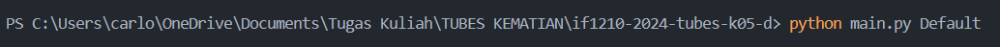

# IF1210 - Dasar Pemrograman 2024
> Tugas Besar - IF1210 Dasar Pemrograman 2024

# About
Pada tugas besar ini, mahasiswa ditugaskan untuk membuat program turn-based game. Pada program ini, user berperan sebagai agent O.W.C.A (Organisasi Warga Cool Abiez) dengan objektif membantu Agent Purry mengalahkan Dr. Asep Spakbor yang telah menciptakan monster-monster kuat yang mengancam keamanan kota Danville. Agent Purry merasa monster-monster ini terlalu kuat untuknya, sehingga ia meminta user untuk mencari dan melatih monster-monster untuk digunakan dalam melawan Dr. Asep Spakbor. Misi mencari dan melatih monster-monster ini dimulai di hutan terpencil, karena diyakini bahwa di hutan terdapat banyak monster. 

# Contributors
Tugas besar ini dikerjakan dengan sepenuh hati oleh Kelompok D K-05 untuk memenuhi tugas mata kuliah Dasar Pemrograman Semester 2 2023/2024

| NIM | NAMA |
|---|---|
|19623005  |Carlo Angkisan  |
|19623205  |Matthew Sebastian Kurniawan  |
|16523005  |Abednego Ozoralael S  |
|16523155  |Dahayu Aqila Suseno  |
|16523255  |Mahardwitiyajati Satrio Prabowo  |

# Features
| Features | Keterangan |
|---|---|
|F00 - RNG |Menghasilkan bilangan acak dari sebuah range untuk mendapatkan kemunculan jumlah OC (O.W.C.A Coin) dan monster yang acak |
|F01 - Register |Melakukan registrasi awal | 
|F02 - Login |Melakukan login ke dalam sistem |
|F03 - Logout |Melakukan logout akun dari sistem |
|F04 - Menu & Help|Keluar dari akun yang sedang digunakan | 
|F07 - Inventory |Melihat owca-dex yang dimiliki oleh Agent |
|F08 - Battle |Bertarung melawan monster secara random |
|F09 - Arena |Pertarungan dengan aturan seperti battle selama 5 stage |
|F10 - Shop & Currency |Tempat Agent membeli monster dan potion menggunakan owca-coin |
|F11 - Laboratory|Tempat Agent melakukan upgrade level monster yang dimiliki di inventory |
|F12 - Shop Management|Tempat Admin melakukan manajemen pada SHOP sebagai tempat jual beli perlatan Agent | 
|F13 - Monster Management|Tempat Admin mengatur manajemen monster di dalam owca-dex |
|F14 - Load|Melakukan load data permainan |
|F15 - Save|Menyimpan progress user ke dalam file |
|F16 - Exit|Keluar dari permainan |

# How to Run
1. Clone this repository to your local computer
2. Run in your terminal "python main.py (Default)" to load the game

3. Enjoy the game! :b
4. You can also save your game data by using "SAVE" command

